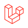
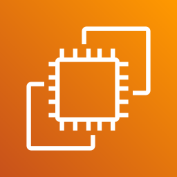

<!-- Banner -->

<!-- Typing headline -->

 

  
  
  
  

<!-- Socials -->

  
  
  
  

  

<!-- Animated section heading: About -->

  

I am a **Software & AI Engineer** with a deep passion for building high-performance Next.js applications, decentralized Web3 protocols, and distributed AI telemetry systems. I bridge the gap between stunning frontend aesthetics and robust, scalable AI backends. 

- 🎓 **Education:** B.E. Electronics and Computers @ Thapar Institute of Engineering and Technology *(CGPA: 8.02 | 2027)*
- 🏆 **Achievements:** 
  - 🏅 **India Book of Records Holder** *(Fastest Memory Practitioner)*
  - 🥇 **Winner**, Most Innovative Hack @ HackSpire 2025
  - 🌟 **Top Submission Recognition** @ CodeCircuit.ai
  - 🚀 **Finalist**, Qualcomm Edge AI Hackathon & Israeli-Indian Hackathon
- ⚡ **Currently:** Building intelligent agents with LangGraph and crafting GSAP-powered 3D web experiences.

  

<!-- Animated section heading: Experience -->

  

<table>
  <tr>
    <td width="50%" valign="top">
      <h3>🏢 Frontend Developer</h3>
      <b>Outlier.ai</b> <i>(July 2025 – Dec 2025)</i> 
       
      <ul>
        <li>Engineered high-performance <b>Next.js</b> applications.</li>
        <li>Architected scalable solutions using <b>TypeScript</b> & TailwindCSS.</li>
        <li>Implemented fluid animations with <b>GSAP</b> and optimized rendering performance.</li>
      </ul>
    </td>
    <td width="50%" valign="top">
      <h3>🛠️ SDE Intern</h3>
      <b>Halliburton</b> <i>(May 2025 – July 2025)</i> 
       
      <ul>
        <li>Developed scalable web apps with <b>Next.js</b> & <b>TypeScript</b>.</li>
        <li>Built robust CI/CD pipelines & integrated third-party APIs.</li>
        <li>Implemented SSR and Dynamic Routing for high-speed Vercel deployments.</li>
      </ul>
    </td>
  </tr>
</table>

**🚀 Head of Technology** @ **Saturnalia TIET** *(Sep 2025 – Nov 2025)*
> Architected a robust event-tech platform. Spearheaded infrastructure leadership, scaling CI/CD, security protocols, and observability for thousands of concurrent users.

  

<!-- Animated section heading: Featured Projects -->

  

<table>
  <tr>
    <td width="50%" valign="top">
      <h3><a href="https://github.com/DEEPESH-845/Guardiant">🛡️ Guardiant</a></h3>
      
Decentralized Web3 security protocol for protecting digital assets using ML anomaly detection.

      <b>Tech:</b> <code>Next.js</code> <code>Solidity</code> <code>PyTorch</code> <code>NetworkX</code>
    </td>
    <td width="50%" valign="top">
      <h3><a href="https://aetheris-xi.vercel.app/">🌐 AETHERIS</a></h3>
      
Distributed AI telemetry and threat-analysis platform running real-time monitoring streams.

      <b>Tech:</b> <code>Next.js</code> <code>FastAPI</code> <code>LangGraph</code> <code>WebSockets</code>
    </td>
  </tr>
  <tr>
    <td width="50%" valign="top">
      <h3><a href="https://kinetic-keys.vercel.app/">🎹 Kinetic Keys</a></h3>
      
A highly interactive 3D keyboard customization platform blending e-commerce with rich WebGL.

      <b>Tech:</b> <code>Three.js</code> <code>GSAP</code> <code>Stripe</code> <code>TypeScript</code>
    </td>
    <td width="50%" valign="top">
      <h3><a href="https://deepesh-845.github.io/Periodic-Table/">🧪 3D Periodic Table</a></h3>
      
Immersive, interactive educational visualization platform mapping atomic elements in 3D space.

      <b>Tech:</b> <code>Three.js</code> <code>JavaScript</code> <code>HTML</code> <code>CSS</code>
    </td>
  </tr>
</table>

  

<!-- Animated section heading: Tech -->

  

<!-- Using EXACTLY all 48 icons from the assets folder -->

   &nbsp;
   &nbsp;
   &nbsp;
   &nbsp;
   &nbsp;
   &nbsp;
   &nbsp;
   &nbsp;
   &nbsp;
  

   &nbsp;
   &nbsp;
   &nbsp;
   &nbsp;
   &nbsp;
   &nbsp;
   &nbsp;
  

   &nbsp;
   &nbsp;
   &nbsp;
   &nbsp;
   &nbsp;
   &nbsp;
   &nbsp;
  

   &nbsp;
   &nbsp;
   &nbsp;
   &nbsp;
   &nbsp;
  

   &nbsp;
   &nbsp;
   &nbsp;
   &nbsp;
   &nbsp;
  

   &nbsp;
   &nbsp;
   &nbsp;
   &nbsp;
   &nbsp;
  

   &nbsp;
   &nbsp;
   &nbsp;
  

  

<!-- Animated section heading: GitHub Analytics -->

  

  
  

  
  

    
 
 

  

  

  
  

  

  

<!-- Footer -->

  

