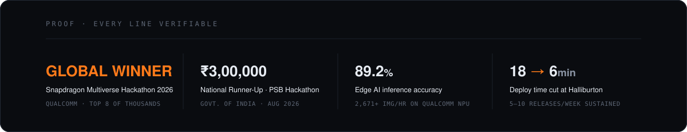
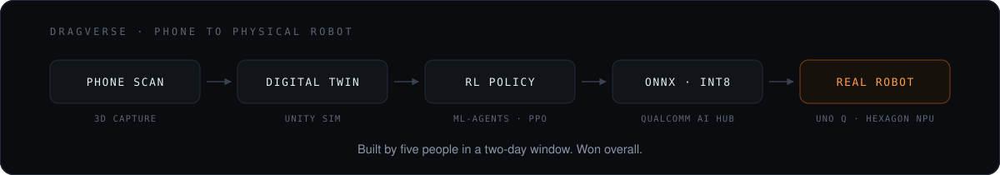
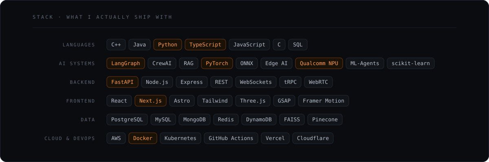
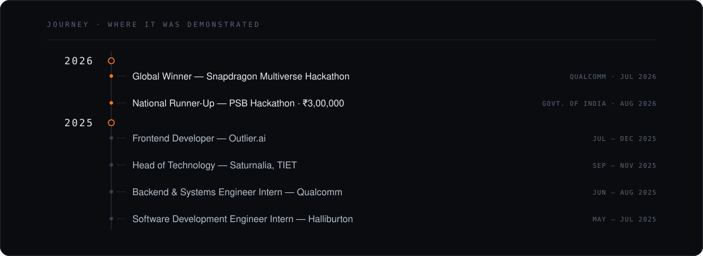
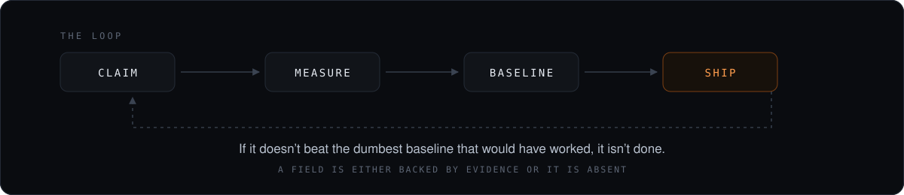
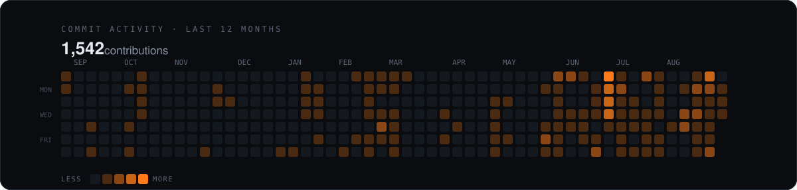
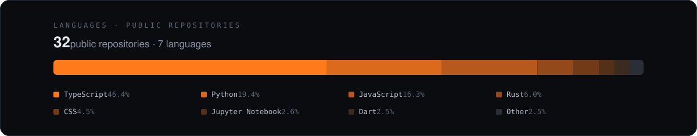

<!-- ══════════════════ HERO ══════════════════ -->

**[Portfolio](https://deepesh.qzz.io/)**&nbsp; · &nbsp;**[LinkedIn](https://www.linkedin.com/in/deepesh-kakkar/)**&nbsp; · &nbsp;**[Email](mailto:deepeshkakkar.work@gmail.com)**&nbsp; · &nbsp;**[Repositories](https://github.com/DEEPESH-845?tab=repositories)**

I build backend and AI systems — Edge AI inference, multi-agent pipelines, and the production
services around them. B.E. Electronics &amp; Computers, Thapar Institute, class of 2027.

---

<!-- ══════════════════ 01 · PROOF ══════════════════ -->
**`01 / PROOF`**

---

<!-- ══════════════════ 02 · SELECTED WORK ══════════════════ -->
**`02 / SELECTED WORK`**

### `01` &nbsp;DRAGVERSE &nbsp;—&nbsp; *Global Winner, Snapdragon Multiverse Hackathon 2026*

A phone scan becomes a simulation-ready digital twin, a PPO policy learns to drive it, and that
same policy — exported to ONNX and quantised to INT8 — runs in real time on a Hexagon NPU inside
a physical robot, with STM32 motor control and a hardware emergency stop.

`Unity ML-Agents` `PPO` `ONNX INT8` `Qualcomm AI Hub` `Arduino UNO Q` `STM32`

**[Live demo →](https://drag-verse-beta.vercel.app/)**

 

### `02` &nbsp;SOLARSAGE &nbsp;—&nbsp; *Global Finalist, Qualcomm Edge AI Hackathon 2025*

Multi-agent computer vision that decides whether cleaning a solar panel pays for itself.
**89.2%** inference accuracy at **2,671+ images/hour** on-device, with **87.3%** decision
confidence — the pipeline Qualcomm later invited me to productionise with their team.

`CrewAI` `PyTorch` `FastAPI` `Qualcomm NPU` `Llama`

**[Repository →](https://github.com/DEEPESH-845/SolarSage.Ai)**

 

### `03` &nbsp;AETHERIS &nbsp;—&nbsp; *autonomous cyber deception*

Attackers get routed into an AI-generated sandbox replica before production is touched.
LangGraph reasoning over live WebSocket telemetry, MITRE ATT&CK enrichment, automated response.

`Next.js` `FastAPI` `LangGraph` `WebSockets` `Docker`

**[Live →](https://aetheris-xi.vercel.app)**&nbsp; · &nbsp;[Source](https://github.com/DEEPESH-845/Aetheris)

 

### `04` &nbsp;CALNINO &nbsp;—&nbsp; *70–100 weekly active users*

A zero-hydration financial engine: 10+ deterministic tools for mortgage, investment and
retirement planning, with scenario simulation. Nothing about your money leaves the browser.

`Astro` `TypeScript` `Tailwind` `Cloudflare`

**[calnino.com →](https://www.calnino.com)**&nbsp; · &nbsp;private repository

 

### `05` &nbsp;ZEROCLOUD &nbsp;—&nbsp; *what can this laptop actually run?*

A Rust CLI that measures your machine in about two seconds, then predicts decode throughput,
time-to-first-token and maximum context across 26 local models. Under 5 MB, no telemetry —
and every printed number is recomputed from a clean clone by `zc gate`.

`Rust` `Metal + CPU backends` `Apache-2.0`

**[Install →](https://github.com/DEEPESH-845/ZeroCloud)**

<b><code>+ 6 more builds</code></b>

 

| Build | One line | Stack |
|---|---|---|
| **[Guardiant](https://github.com/DEEPESH-845/Guardiant)** | Wallets that self-destruct before a rug pull completes — graph analytics cut fraud-detection latency 85% | Solidity · PyTorch · NetworkX |
| **[Nivaaran](https://nivaaran-pi.vercel.app)** | Runs every check EPFO will run *before* you file, and names who has to fix what | Next.js 16 · TypeScript |
| **[CrisisLink](https://github.com/DEEPESH-845/CrisisLink)** | AI triage for India's 112 network — classifies multilingual calls in under 3s, dispatches the nearest unit | Python · Gemini · Whisper |
| **[Credify](https://github.com/DEEPESH-845/Credify)** | On-chain professional credentials — tamper-proof degrees and certifications | Solidity · OpenZeppelin · IPFS |
| **[NeuroTrace](https://github.com/DEEPESH-845/NeuroTrace)** | On-device neurological monitoring through the 90-day post-stroke window | React Native · ONNX · Phi-3 |
| **[Kinetic Keys](https://kinetic-keys.vercel.app/)** | 3D keyboard configurator with Stripe checkout — 35% faster render pipeline | Three.js · GSAP · Stripe |

---

<!-- ══════════════════ 03 · STACK ══════════════════ -->
**`03 / STACK`**

---

<!-- ══════════════════ 04 · JOURNEY ══════════════════ -->
**`04 / JOURNEY`**

**Also** — Finalist, ISB Secure Bharat CyberSec 2026 · Winner, Most Innovative Hack, HackSpire 2025 ·
Finalist, Indo-Israeli Hackathon 2025 · Top submission, CodeCircuit.ai · India Book of Records holder,
Fastest Memory Practitioner

---

<!-- ══════════════════ 05 · HOW I WORK ══════════════════ -->
**`05 / HOW I WORK`**

---

<!-- ══════════════════ 06 · NOW ══════════════════ -->
**`06 / NOW`**

`Open to`&nbsp; internship and new-grad conversations for 2027 &nbsp;<!-- edit as this changes -->

---

<!-- ══════════════════ 07 · ACTIVITY ══════════════════ -->
<!-- contributions.svg + languages.svg are regenerated daily by .github/workflows/contributions.yml -->
**`07 / ACTIVITY`**

---

<!-- ══════════════════ FOOTER ══════════════════ -->

**[Portfolio](https://deepesh.qzz.io/)**&nbsp; · &nbsp;**[LinkedIn](https://www.linkedin.com/in/deepesh-kakkar/)**&nbsp; · &nbsp;**[Email](mailto:deepeshkakkar.work@gmail.com)**&nbsp; · &nbsp;**[GitHub](https://github.com/DEEPESH-845)**

© 2026 Deepesh Kakkar

