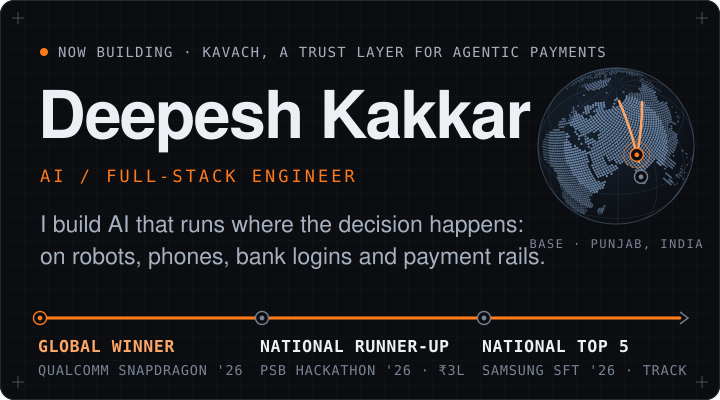
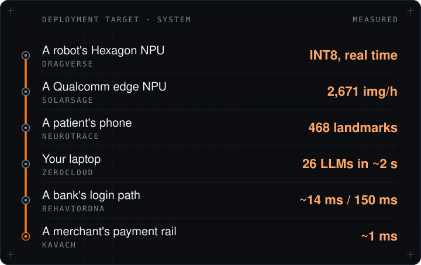
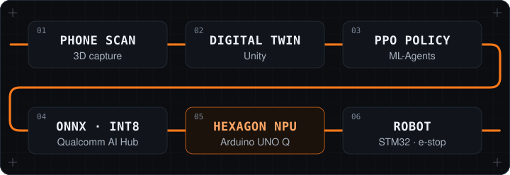
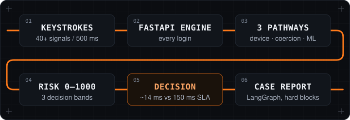
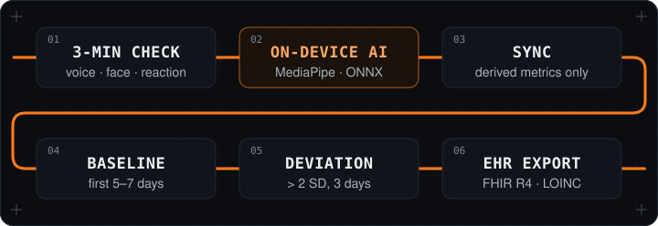
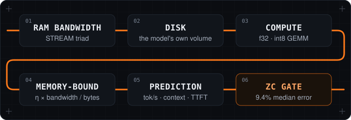
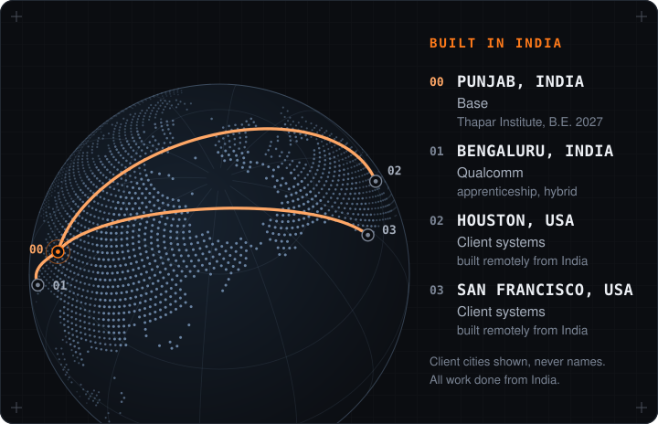
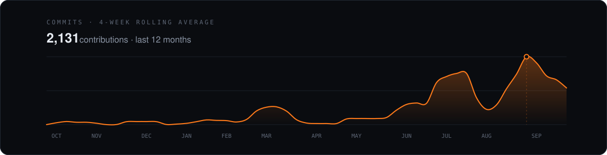
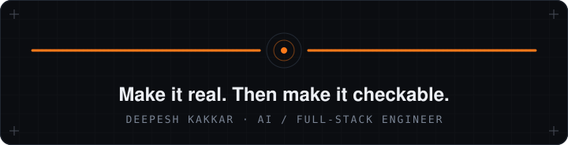

<!--
  Panels in assets/ are generated. Edit data/profile.toml, then run: python3 scripts/render.py
  activity.svg refreshes daily via .github/workflows/contributions.yml. Full notes: docs/PROFILE.md
-->

**[Selected systems ↓](#02-selected-systems)** &nbsp;·&nbsp; [Portfolio](https://deepesh.qzz.io/) &nbsp;·&nbsp; [LinkedIn](https://www.linkedin.com/in/deepesh-kakkar/) &nbsp;·&nbsp; [Email](mailto:deepeshkakkar.work@gmail.com)

Final-year Electronics &amp; Computer Engineering at Thapar Institute; previously at Qualcomm, Halliburton and Outlier.ai. Two systems are live now: [Kavach](https://kavach-production-0363.up.railway.app/tour/) decides in ~1 ms whether an AI agent's payment goes through, and [ZeroCloud](https://github.com/DEEPESH-845/ZeroCloud#install) predicts how fast a local LLM will run on your laptop before you download it.

 

## `01` Where my models run

The deployment target is the architecture. Every target I've built for, with the number that mattered there.

 

## `02` Selected systems

### DragVerse

`GLOBAL WINNER` &nbsp;Qualcomm Snapdragon Multiverse Hackathon 2026

**A phone scan of a room becomes a robot that drives it, in two days.**

- **Problem** &nbsp;Robot policies are trained in simulators that rarely match the room the robot will actually drive.
- **System** &nbsp;Scan the real room, build a simulation-ready digital twin, and train a PPO policy inside it.
- **On device** &nbsp;The same policy, exported to ONNX and quantised to INT8, runs in real time on a Hexagon NPU, with STM32 motor control and a hardware e-stop.
- **Outcome** &nbsp;Overall 1st among thousands of applicants. Built by a team of five.

[**Live demo →**](https://drag-verse-beta.vercel.app/)

 

### BehaviorDNA

`NATIONAL RUNNER-UP` &nbsp;PSB Hackathon 2026 · ₹3,00,000 prize

**Banking that checks *who* is typing, not only what they typed.**

- **Problem** &nbsp;Stolen credentials and SIM swaps pass every password check.
- **System** &nbsp;A client SDK streams 40+ behavioural signals to a FastAPI engine that fuses device trust (Hyperledger Fabric, with a Redis fast path under 1 ms), coercion context and ML into one risk score.
- **Models** &nbsp;BehaveFormer transformer: ROC-AUC 0.944 on 10,000 users. XGBoost on a leak-free temporal split: 0.868. An earlier near-perfect model was deleted when its score traced to data leakage.
- **Outcome** &nbsp;~14 ms per decision against a 150 ms SLA. 2nd of 226 teams.

[**Live demo →**](https://frontend-one-xi-76.vercel.app/) &nbsp;·&nbsp; source private

 

### NeuroTrace

`NATIONAL TOP 5 IN TRACK` &nbsp;Samsung Solve for Tomorrow 2026

**A three-minute daily stroke check that never sends your face to a server.**

- **Problem** &nbsp;Decline in the 90 days after a stroke is easy to miss between clinic visits.
- **On device** &nbsp;MediaPipe's 468 face landmarks score asymmetry; quantised Phi-3-Mini on ONNX Runtime extracts speech biomarkers. Raw biometrics never leave the phone.
- **Intelligence** &nbsp;Each patient is their own baseline. An alert fires past 2 standard deviations sustained for 3 days, graded at 2, 3 and 4 SD.
- **Outcome** &nbsp;Clinician-ready FHIR R4 export. Top 20 overall from 40,000+ applications.

[**Live demo →**](https://neuro-trace-v1.vercel.app/)

 

### ZeroCloud

`OPEN SOURCE` &nbsp;Rust CLI · v0.1.0 · Apache-2.0

**What can this laptop actually run, and how fast?**

- **Problem** &nbsp;Spec sheets hide what actually sets local-LLM speed on cheap hardware: single-channel RAM, an iGPU holding system memory, a DRAM-less SSD, WSL2 quietly halving your RAM.
- **System** &nbsp;`zc` measures RAM bandwidth, disk and compute in about 2 seconds, then predicts decode speed, time to first token and maximum context for 26 catalogued models, or any Hugging Face repo.
- **Honesty** &nbsp;Predictions are ranges, never points. Every number is measured, derived from measured inputs, or printed as `-`. `zc gate` recomputes accuracy from a clean clone: **9.4% median error** across 8 machines.
- **Outcome** &nbsp;v0.1.0 binaries for macOS, Linux and Windows. Under 5 MB, zero network by default, and an HTTP and MCP server so agents can ask what a machine can run before suggesting a model.

[**Install →**](https://github.com/DEEPESH-845/ZeroCloud#install) &nbsp;·&nbsp; [Source](https://github.com/DEEPESH-845/ZeroCloud) &nbsp;·&nbsp; Pre-1.0: one more bare-metal laptop closes its accuracy gate. If you have one, `zc verify` and `zc share` take about 20 minutes.

 

### SolarSage

`GLOBAL FINALIST` &nbsp;Qualcomm Edge AI Developer Hackathon 2025

**Decides whether cleaning a solar panel pays for itself, on the device.** CrewAI agents reason over on-device computer vision on a Qualcomm NPU: **89.2%** accuracy at **2,671+ images/hour**, 87.3% decision confidence. Qualcomm then invited me to build a production desktop version with its engineers.

[**Console →**](https://solarsage-console.vercel.app) &nbsp;·&nbsp; [Source](https://github.com/DEEPESH-845/SolarSage.Ai)

 

### Calnino

`LIVE PRODUCT` &nbsp;70–100 weekly active users

**Mortgage, refinancing, investment and retirement maths, as tools people come back to weekly.** 10+ deterministic tools with scenario simulation. Astro and TypeScript on Cloudflare, multilingual and SEO-native.

[**calnino.com →**](https://www.calnino.com) &nbsp;·&nbsp; source private

<b>7 more builds</b>

 

- **[Guardiant](https://guardiant.vercel.app/)**: graph analytics and ML flag a wallet before a rug pull completes, cutting fraud-detection latency by 85%. Solidity contracts move the assets out. [source](https://github.com/DEEPESH-845/Guardiant)
- **[Aetheris](https://aetheris-xi.vercel.app)**: the operator console for routing attackers into AI-generated sandbox twins. Interactive prototype; the threat feed is simulated. [source](https://github.com/DEEPESH-845/Aetheris)
- **[Nivaaran](https://nivaaran-pi.vercel.app)**: runs every check EPFO will run before you file a PF claim, and names who has to fix each mismatch. [source](https://github.com/DEEPESH-845/Nivaaran)
- **[CrisisLink](https://github.com/DEEPESH-845/CrisisLink)**: an AI triage co-pilot for India's 112 line. It classifies multilingual calls and dispatches the nearest unit.
- **[GantryLab](https://hydra-loom.vercel.app)**: a browser twin of an underwater-robotics test rig (camera gantry, detection, control policy). Simulated in the browser; the Python backend targets the real rig.
- **[Credify](https://credify-lime.vercel.app)**: tamper-proof degrees and certifications, on-chain. [source](https://github.com/DEEPESH-845/Credify)
- **[Kinetic Keys](https://kinetic-keys.vercel.app/)**: a 3D keyboard configurator with Stripe Checkout and 35% better animation performance. [source](https://github.com/DEEPESH-845/Kinetic-Keys)

 

## `03` Record

Also on the record: Top submission, Codecircuit.ai (2025) · India Book of Records, Fastest Memory Practitioner (2018).

**Qualcomm** · Backend &amp; Systems Engineer, apprenticeship · Jun–Aug 2025 · hybrid, Bengaluru 
Built an Edge AI inference pipeline for Qualcomm NPUs → trained and benchmarked vision models on enterprise GPUs → **89.2% accuracy at 2,671+ images/hour** on the target hardware. Invited after the Edge AI Hackathon global finals.

**Halliburton** · Software Development Engineer, intern · May–Jul 2025 · remote 
Automated CI/CD with GitHub Actions and Vercel → **deploys cut from 18 to 6 minutes** at 5–10 releases a week. Shipped a 20+ page Next.js and TypeScript platform with server-side rendering.

**Outlier.ai** · Frontend Developer, freelance · Jul–Dec 2025 · remote 
Built TypeScript applications using GenAI workflows and automation.

**Saturnalia, TIET** · Head of Technology · Sep–Nov 2025 
Led the team behind the fest platform. Integrated payments, ticketing and CDN behind RBAC, set up zero-downtime CI/CD, and added dashboards with incident workflows.

*B.E. Electronics &amp; Computer Engineering · Thapar Institute of Engineering &amp; Technology · 2023–2027*

 

## `04` Reach

**[Explore the interactive globe →](https://deepesh-845.github.io/DEEPESH-845/globe/)**  &nbsp;Drag to rotate; same data as above.

 

## `05` Principles

**01 · The deployment target is the architecture.** 
A fixed NPU memory budget doesn't make the problem smaller. It makes it a different problem, so I design backwards from the device.

**02 · Build the eval before the model.** 
BehaviorDNA once had a near-perfect fraud model. I deleted it the day its score traced back to data leakage.

**03 · Fail soft, everywhere.** 
If the ledger, the LLM or the model weights disappear, a genuine customer still logs in. The model is the smallest part of the system.

**04 · Latency is a feature.** 
14 ms against a 150 ms budget is the product. Accuracy that arrives late is a research result.

**05 · Ranges, never points.** 
ZeroCloud's prediction band claimed 90% coverage. Its own gate measured 54.5%. I fixed the method, not the claim, and the band got wider and honest.

 

## `06` Stack, by the job it did

- **On-device AI** &nbsp;ONNX Runtime · INT8 quantisation · Qualcomm AI Hub / QAIRT · MediaPipe → <i>DragVerse · SolarSage · NeuroTrace</i>
- **Models &amp; evaluation** &nbsp;PyTorch · XGBoost · scikit-learn · SHAP · Unity ML-Agents (PPO) → <i>BehaviorDNA · DragVerse · Guardiant</i>
- **Agents** &nbsp;LangGraph · CrewAI · MCP · Llama via Groq → <i>BehaviorDNA · SolarSage · Kavach · ZeroCloud</i>
- **Backend &amp; data** &nbsp;Python · FastAPI · Node.js · PostgreSQL · Prisma · Redis · Hyperledger Fabric (Go) → <i>BehaviorDNA · NeuroTrace</i>
- **Product** &nbsp;TypeScript · Next.js · React Native · Astro · Three.js · Tailwind → <i>Calnino · NeuroTrace · Halliburton</i>
- **Systems &amp; delivery** &nbsp;Rust · Docker · GitHub Actions · Vercel · Cloudflare → <i>ZeroCloud · Halliburton CI/CD · Calnino</i>

 

## `07` Now

> **Kavach** · the merchant-side trust layer for agentic commerce
>
> Agents now stand on both sides of a merchant's counter. Buyer agents arrive at checkout carrying mandates nobody can verify, and the merchant's own agents move money out. Kavach verifies agents coming in, governs agents acting out, and writes tamper-evident proof of every decision. Cryptography and integer arithmetic sit at the edges. Trained models sit in the middle, and they may only ever move a decision toward more caution.
>
> On its generated benchmark, at equal human-review cost, duplicate-refund leakage falls from **₹1,84,636** under a hand-written rule to **₹14,257**. Decisions take **~1 ms**, in process, with no network call on the decision path.
>
> **[Take the 5-minute tour →](https://kavach-production-0363.up.railway.app/tour/)** &nbsp;(Razorpay test mode) &nbsp;·&nbsp; [Source](https://github.com/DEEPESH-845/Kavach)

`Open to` &nbsp;internship and new-grad conversations for 2027 <!-- edit as this changes -->

 

## `08` Signal

 

**[deepeshkakkar.work@gmail.com](mailto:deepeshkakkar.work@gmail.com)** &nbsp;·&nbsp; [LinkedIn](https://www.linkedin.com/in/deepesh-kakkar/) &nbsp;·&nbsp; [Portfolio](https://deepesh.qzz.io/)

